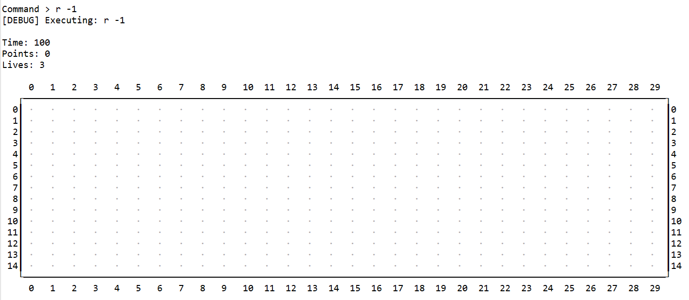

## Table of contents

- [Assignment 2 - Part II: Mario Extended](#práctica-2---parte-ii-mario-extended)
- [The `addObject` command and the game-object factory](#AddObjectCommand-y-factoría-de-objetos)
  - [The game-object external-representation format](#formato-de-objetos-del-juego)
  - [The game-object factory](#factory)
  - [New command: `addObject`](#comando-addobjectcommand)
	- [Creating maps using the `addObject` command](#draw-map)
- [New game objects: box and mushroom](#box-mushroom)
  - [Mushroom](#mushroom)
  - [Box](#box)
- [Testing](#pruebas)
- [Submission](#entrega)
  
<!-- TOC end -->
<!-- TOC --><a name="práctica-2-parte-ii-mario-extended"></a>
# Assignment 2 - Part II: Mario Extended

**Objectives:** Inheritance, polymorphism, abstract classes and interfaces.

<!--
**Preguntas Frecuentes**: Como es habitual que tengáis dudas (es normal) las iremos recopilando en este [documento de preguntas frecuentes](../faq.md). Para saber los últimos cambios que se han introducido [puedes consultar la historia del documento](https://github.com/informaticaucm-TPI/2425-Lemmings/commits/main/enunciados/faq.md).
-->

In this assignment, we will extend the code with new functionality. The principle objective is to add new commands and new game objects
to the game. But first a **warning**:

**IMPORTANT**: Any of the following serious errors, on its own, is sufficient reason to fail the assignment (**and to fail the exam if you commit such errors in the programming exam**):

- Breaking encapsulation, so:
  * all attributes must be private,
  * a class cannot export data that is `private`, in particular, an object that is the value of one of its (private)
    attributes or an object that is referenced by the value of one of its (private) attributes, unless the exported
    object is immutable or unless its type is an interface such as `GameItem` that severely restricts access to it;
    in particular, the
    `GameObjectContainer` class cannot export an object of type `GameObject` or one of its subtypes, nor a list of game
    objects, nor a reference to itself, via `this`, in order to provide access to such a list. Note that a method
    of the `GameObjectContainer` class that is `private` is not exporting anything.
    + The term "export" here refers to giving access to an object either by defining a non-private method that returns 
      it or by passing it as an argument in an invocation of a method of another class [^1].
- Using `instanceof` or `getClass` (apart from in an equals method), since:
  * identifying the dynamic type of objects is simply a way of avoiding the use of
    polymorphism and dynamic binding, i.e. of avoiding the use of OOP.
- Using a *DIY instanceof* (e.g. each subclass of `GameObject` has a set of methods `isX`, one for each concrete subclass of
  `GameObject`, where the method `isX` returns `true` in the concrete `GameObject` subclass `X` and `false` in any other concrete
   `GameObject` subclass).
   * Such a solution is even worse than using `instanceof` or `getClass` since it is simply a clumsier, more verbose, way
     of identifying the dynamic type of game objects.

[^1]: With regard to the second point, notice that in the generic interaction mechanism
described in part I of this assignment, the type of the parameter of the methods
`doInteractions` of the `GameObjectContainer` class and `interactWith` of the `GameItem`
interface is `GameItem`, not `GameObject` nor a subtype of `GameObject`.

<!-- TOC --><a name="AddObjectCommand-y-factoría-de-objetos"></a>
## The `addObject` command and the game object factory

In this section we create a new command, `addObject` represented by the `AddObjectCommand` class, which enables the
player to add a game object of any of the existing game-object types at a designated position on the board. This
command can either be viewed as a command designed to help the developer debug the application, or as a minecraft-style
command designed to enable the player to define their own maps or extend existing maps.

In order to add the command in an extensible manner (i.e. so that its functionality can be easily extended if new game objects
are introduced to the game), we use a game-object factory that is similar to the command factory used in the
first part of this assignment (i.e. the `CommandGenerator` class). The factory will create a game object from
a string representation of that object, which includes information about its position, this representation having been
provided as an argument to the `addObject` command. We first define the format of the external representation.

<!-- TOC --><a name="formato-de-objetos-del-juego"></a>
## The game-object external-representation format

The outline of the format is as follows:
```
    position type attributes
```
which we clarify with the following examples of valid strings:

- The string:
  ```
  "(1,2) MARIO RIGHT BIG"
  ```
  represents a `Mario` object

  - whose current position is row 1, column 2,
  - whose current direction of movement is left-to-right, the default value of this attribute, the other possible values being `LEFT` and `STOP` [^2],
  - whose current size is `BIG` (i.e. for whom the value of `isBig` is `true`), the default value of this attribute, the other possible value being `SMALL`.

  The existence of default values means that `(1,2) MARIO` represents the same object as the above string and, for example, `(1,2) MARIO LEFT` represents
  the same object as `(1,2) MARIO LEFT BIG`.

- The string:
  ```
  "(0,1) GROUND",
  ```
  represents a `Ground` object
  - whose current position is row 0, column 1. 

- The string:
  ```
  "(3,2) GOOMBA RIGHT",
  ```
  represents a `Goomba` object
  - whose current position is row 3, column 2
  - whose current direction of movement is left-to-right, the other possible value of this attribute, the default value, being `LEFT`.
  
- The string:
  ```
   "(2,7) EXITDOOR"
  ```
  represents an `ExitDoor` object
  - whose current position is row 2, column 7.
  
In addition, abbreviations can be used for the game objects (``M``, ``G``, ``Gr`` y ``ED`` for ``Mario``, ``Goomba``, ``Ground``  and ``ExitDoor`` respectively), for the movement directions (``L``, ``R`` and `S` for ``LEFT``, ``RIGHT`` and `STOP` respectively) and for the sizes of Mario (``B`` and ``S`` for ``BIG`` and ``SMALL`` respectively).

[^2]: Even if Mario is in the air in the position provided, his direction of movement is needed in order to draw him correctly;
it will also determine his movement when he reaches the ground.


<!-- TOC --><a name="factory"></a>
## The game-object factory

Next we add an object factory to our implementation, the idea being to separate the object-creation logic from the creation itself. The mechanism is pratically the same as that of the `Command` pattern. The class implementing the factory, which should be called `GameObjectFactory` and placed in the ``gameobjects`` package, is similar to the `CommandGenerator` class. It has the following method:
```java
	public static GameObject parse (String objWords[], GameWorld game);
```
Creating the game object whose external representation (split into tokens) is contained in the array of strings `objWords` is carried out using this method as follows:
```java
GameObject gameobject = GameObjectFactory.parse(String objWords[], GameWorld game);
```
The code of the GameObjectFactory is generic (i.e. does not know the dynamic type of the objects being created), except for the list of available game objects, which is similar to the list of available commands:
in the `CommandGenerator` class:
```java
private static final List<GameObject> availableObjects = Arrays.asList(
	new Ground(),
	new ExitDoor(),
	new Goomba(),
	new Mario(),
	......
);
```
Similarly to the `parse` method of the `CommandGenerator`, the `parse` method of the `GameObjectFactory` calls a `parse` method in
each of the list `availableObjects`, which checks if the `objWords` array of strings contains an external representation
(split into tokens) of an object of its class and, if so, returns a new instance of that class with the required characteristics,
otherwise, it returns `null`. Note that the simplest of the concrete `GameObject` subclasses can simply use a `parse` method
inherited from the `GameObject` class, moving objects can complete the `parse` method inherited from the `GameObject` class (see
"partial redefinition" in the slides) and the `Mario` class can complete the parse method inherited from the `MovingObject` class.
The actual creation is always done, by overwriting, in each concrete `GameObject` subclass.

In order to create the list of `availableObjects`, each concrete subclass of `GameObject` must have a no-argument constructor.
What should be the access modifier for this constructor?


<!-- TOC --><a name="comando-addobjectcommand"></a>
## New command: `addObject`

Having defined the game-object factory, we can now define the `addObject` command. The main characteristics of this command
are the following:
```
Name: addObject
Abbreviation: aO
Details: [a]dd[O]bject <object_description>
Help: adds to the board the object described by object_description
```
where the obligatory `<object_description>` argument contains the external representation of a game object. If the argument is
invalid, i.e. it is not the external representation of a game object, including the case where the position is invalid due
to being off the board, the following error message must be displayed: ``Invalid game object: <object_description>``.

Examples of use of this command:
- `ao (14,3) Ground` adds an object of the class `Ground` in the position `(14,3)`
- `aO (13,3) Goomba RIGHT` adds an object of the class `Goomba` whose current direction of movement is left-to-right in the position `(13,3)`.

*Hints*
- In the `parse` method of the `AddObjectCommand` class, you may wish to use the method `copyOfRange(words, from, to)` of the
  `java.util.Arrays` utility class [^3], which returns a copy of the part of the array `words` that starts at index `from`
  (inclusive) and finishes at index `to` (exclusive).
- In the `run` method of the controller, you may wish to use the method `join(separator, words)` of the `String` class,
  which concatenates the strings of the array `words` adding the character string `separator` between each pair of elements 
  of `words` (use `" "` for the separator).

[^3]: A *utility class* is one that contains only static methods, which therefore never needs to be instantiated.

<!-- TOC --><a name="draw-map"></a>
### Creating maps using the `addObject` command

To enable the player to create new maps using the `addObject` command, we define a new level number ``-1`` corresponding to
an empty map with 3 lives, 100 time units and 0 points. Unlike the other maps, when this map is reset, the number of lives
must also be reset (to 3).


**Initialisation using external representations (optional)**:
Observe that now that we have defined the mechanism to create game objects from their external
representations as strings, for the map-initialisation code of the `Game` class we could use multiple lists of external
representations (e.g. each as `List<String>`) and a single level-initialisation method, which traverses one of the lists
creating and adding all the objects represented on it. This method takes a level-number argument which determines which
of the lists will be used to create the map. The different lists could be stored in an array-valued attribute of the
`Game` class. This modification also enables us to change the access modifier of the constructor with arguments of each
concrete subclass of `GameObject` to `private` protecting against instantiation that is not carried out via the factory.

<!-- TOC --><a name="box-mushroom"></a>
# New game objects: box and mushroom

In this section, we add two new concrete subclasses of `GameObject`, ``Box``, representing the typical question block of
the mario game, and `MushRoom` representing the typical mushroom objects, collions with which convert Mario from small to big.


<!-- TOC --><a name="mushroom"></a>
## Mushroom
Objects of this class, which we will refer to as mushrooms, have the following characteristics:
```
Name: Mushroom
Abbreviation: MU
Icon: 🍄
```

Mushrooms are non-solid, mobile objects which, if `mario` is in the same position, interact with him in the following way:
the mushroom disappears and if `mario` is small he becomes big (if he is already big, he simply stays big). Mushrooms do
not interact with any other game objects. Unlike goombas, the initial direction of movement of mushrooms is from left to
right.

<!-- TOC --><a name="box"></a>
## Box

Objects of this class, which we will refer to as boxes, have the following characteristics:
```
Name: Box
Abbreviation: B
Icon: ? if it is not empty (has not yet been opened) and 0 if it is empty (has been opened)
Points obtained: 50
```
Boxes are solid, non-mobile objects. When `mario`'s position is immediately below a box he interacts with it
in the following way: the box's state changes to empty, Mario receives 50 points and a mushroom appears (in the position
above the box on the next cycle). Boxes, empty or not, behave as `Ground` objects for any game object other than `mario`

In the colours view, boxes are represented by the symbol **?** on a grey background, it the box is not empty, and simply
by a grey background, if the box is empty.

To test these two extensions, we suggest you create a level `2` which is the same as level `1` except for a box in position
`(9,4)` and two mushrooms in positions `(12,8)` y `(2,20)` (using the format `(fila,columna)`). Alternatively, you can simply
add these objects at the start of level `1` using the `addObject` command. Examples of the external representation for boxes to be used with the `addObject` command are the following: `"(3,6) Box"`, `"(3,5) Box Full"`, `"(3,4) Box Empty"` where the latter represents an empty box and the other two, a full box (i.e. the default is `Full`). The abbreviations `"F"` and `"E"` can be used for `"Full"` and `"Empty"` respectively.

<!-- TOC --><a name="pruebas"></a>
## Testing

... to be added

<!-- TOC --><a name="entrega"></a>
## Submission

... to be added


